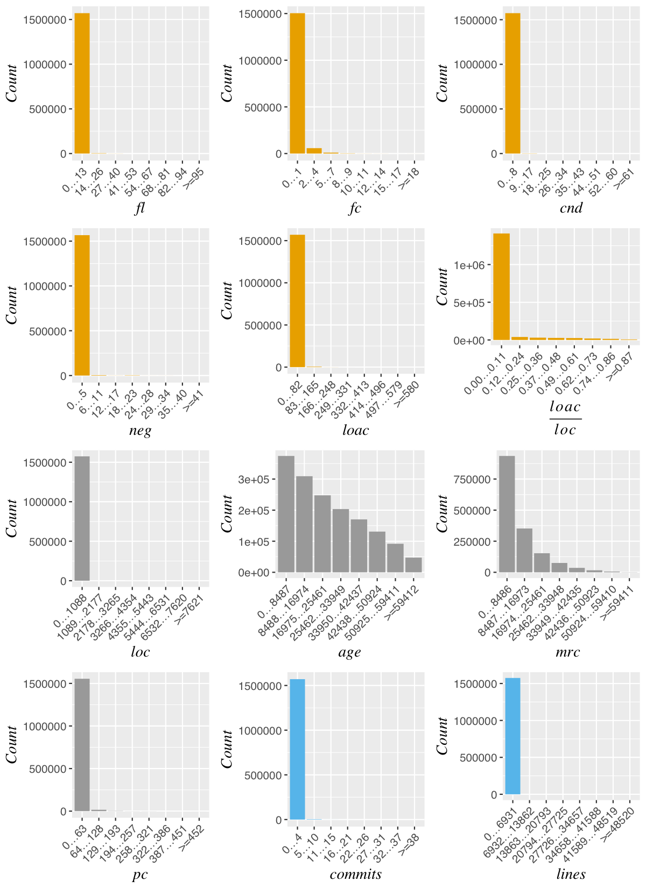
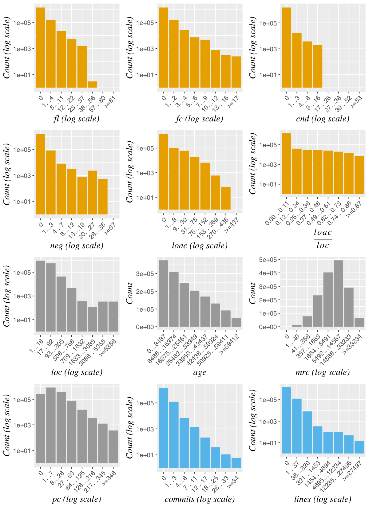
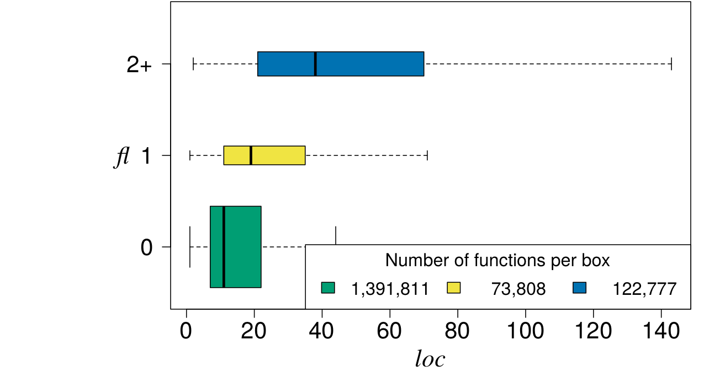
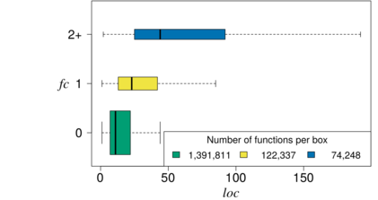
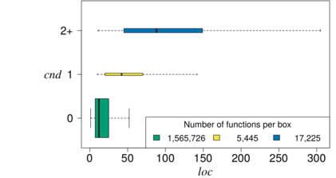
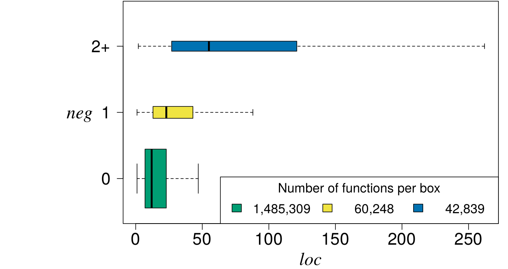

# Data for php

## Raw Data

The compressed raw data of this project exceeds 100MB, which could not
be uploaded due to size restrictions.  The data will be made available
shortly, at the lates by the end of August 2019.

- The file `joint_data.csv` contains all the data collected by IfdefRevolver.
- The files `YYYY-MM-DD/all_functions.csv` contains static metrics of all the functions in the respective snapshot.
- The files `YYYY-MM-DD/ABRes.csv` contains static metrics about preprocessor use of all functions in the respective snapshot.
- The files `YYYY-MM-DD/function_change_hunks.csv` contains change metrics of all functions in the respective snapshot.
- The files `YYYY-MM-DD/snapshot_commits.csv` contains hashes of the commits that the respective snapshot encompasses.
- The results of the statistical tests for RQ1 is in `group_differences.csv`
- The results of the statistical tests for RQ2 is in `spearman.csv`
- The results of the statistical tests for RQ3 is in `logit-reg.csv` (logistic regression results), `logit-reg-std.csv` (logistic regression results after standardization), and `nb-reg.csv` (negative binomial regression with the outcomes "number of commits" and "lines changes").

## Distributions of Independent and Dependent Variables

The first picture visuzalizes the distributions of the variables without log transformations.

The second picture visuzalizes the distributions of the variables after log transformation of the x- and/or y-axis.

## Relationship between Preprocessor Use and Function Size

The following picures visualize the relationshipt between preprocessor use and functions size.

